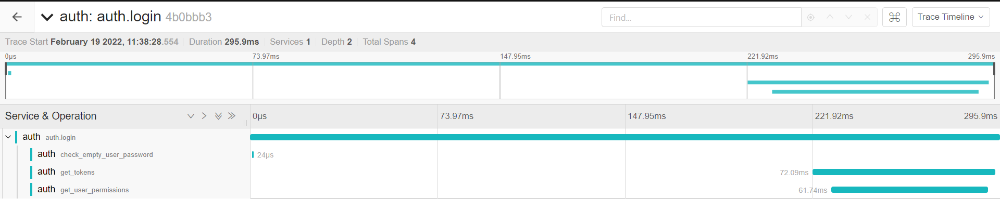

# Проектная работа 6 и 7 спринтов
Задачи по обоим спринтам можно посмотреть в /tasks

## Ссылка на репозиторий с проектом:
https://github.com/AlexanderNkn/Auth_sprint_2

## Описание
Это API для аутентификации пользователей

## Установка
- склонируйте проект с реппозитория GitHub
    ```
    git clone https://github.com/AlexanderNkn/Auth_sprint_2.git
    ```
- переименуйте файл с переменными окружения для тестирования
    ```
    mv auth/envs/.auth.env.sample auth/envs/.auth.env
    mv .movies_api/envs/.movies_api.env.sample movies_api/envs/.movies_api.env
    mv envs/.db.env.sample envs/.db.env
    ```
- соберите образ
    ```
    docker-compose build --no-cache
    ```
- запустите проект
    ```
    docker-compose up -d
    ```

## Тестирование
### В контейнере
- тесты запускаются автоматически при старте контейнера. Для перезапуска выполните
    ```
    docker-compose start test_auth
    docker-compose start test-movies-api
    ```
### Локально
    ```
    pytest auth
    pytest movies_api
    ```
## Использование
### Примеры запросов
- логин пользователя
    ```
    /auth-api/v1/auth/login
    ```
    ```
    curl -X POST "http://localhost/auth-api/v1/auth/login" -H "accept: application/json" -H "Content-Type: application/json" -d "{\"password\":12345,\"username\":\"yandex\"}"

    401	Error: Unauthorized

    {
      "message": "user is not exist",
      "status": "error"
    }
    ```
- изменить роль пользователя
    ```
    /auth-api/v1/role/<uuid:user_id>
    ```
    ```
    curl -X PATCH "http://localhost/auth-api/v1/role/<uuid:role_id>" -H "accept: application/json" -H "Content-Type: application/json" -d "{\"code\":\"admin\",\"description\":\"unlimited access to all actions\"}"

    200	info about role was changed successfully

    Media type
    
    application/json
    Controls Accept header.
    Example Value
    Schema
    {
      "message": "info about role was changed successfully",
      "role": {
        "code": "admin",
        "description": "unlimited access to all actions",
        "id": "a9c6e8da-f2bf-458a-978b-d2f50a031451"
      },
      "status": "success"
    }
    ```

## Дополнительные возможности
- просмотр логов
    ```
    docker-compose logs -f
    ```
- очистка базы данных из консоли
    ```
    flask recreate-database
    ```
- создание суперпользователя из консоли
    ```
    flask create-superuser name password
    ```
### Отслеживание ошибок в Sentry
В переменные окружения добавьте SENTRY_DSN с вашим значением dsn. Документация sentry https://docs.sentry.io/.

При возникновении ошибки Internal Server Error в стандартный ответ добавлен sentry id

    ```
    {
     "message": "Something went wrong with server",
     "sentry": "0a10d6671fc6442f98225ac42eae223f",
     "status": "error"
    }
    ```
### Распределенная трассировка
- Распределенная трассировка реализована с помощью библиотек jaeger-client и Flask-Opentracing.
    Статистика доступна по адресу
    ```
    http://localhost:16686/ui
    ```
- По умолчанию трассировка проводится для эндпойнтов. Если нужно собирать статистику по внутренним методам, к этим методам нужно добавить декоратор @trace
    Пример использования:
    ```
    @trace
    def check_empty_user_password(username, password):
        if not username or not password:
            return make_response(
                {
                    "message": "username/password is empty",
                    "status": "error"
                }, HTTPStatus.BAD_REQUEST)
        return
    ```
    Собранная статистика:
    

## Документация 
### Документация расположена в отдельном контейнере. Openapi-server был сгенерен с помощью swagger-codegen.
- Доступна по адресу
    ```
    http://localhost/ui
    ```
- В json формате
    ```
    http://localhost/openapi.json
    ```
### Примечание
- для создания openapi-server использовался api-spec.yaml
    ```
    java -jar swagger-codegen-cli.jar generate -i docs/api-spec.yml -l python-flask -o openapi-server
    ```
- на сервисе auth доступна локальная копия документации по адресу
    ```
    http://localhost/auth-api/openapi
    ```
