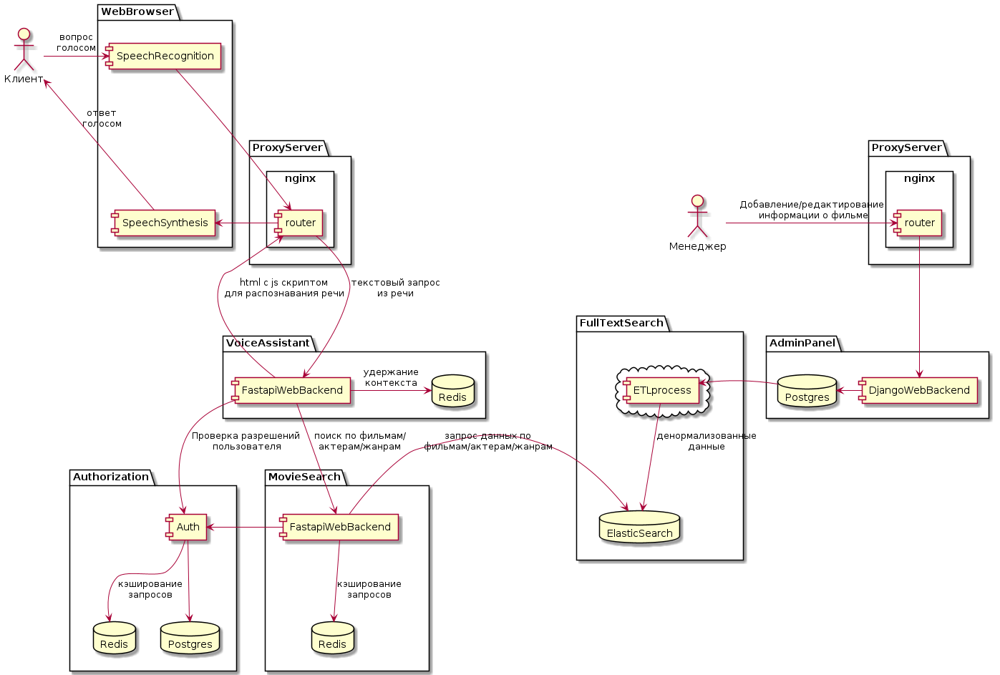

#  Проектная работа: диплом
Задачи можно посмотреть в /tasks

## Ссылка на репозиторий с проектом:
https://github.com/AlexanderNkn/graduate_work

## Описание
Это онлайн-кинотеатр с голосовым поиском по коллекции фильмов.

## Архитектурные решения
- описание диаграмм в формате plantUML представлено в docs/architecture/

### Схема сервиса "голосовой помощник" и связанных с ним сервисов


### Описание диаграммы
Взаимодействие сервисов на диаграмме можно разделить на две составляющие:
- пополнение коллекции фильмов и связанных с ними объектов (например сведения об актерах, режиссерах и т.д.) в соответсвующих базах данных
- поиск контента в базах данных, включая голосовой поиск
1. Администраторы киносервиса через  интерфейс джанго admin-panel добавляют новые фильмы, либо редактируют устаревшие сведения. Данные сохраняются в postgres. Postgres используется только для хранения. Для поиска предусмотрена вторая база ElasticSearch. В ElasticSearch данные регулярно перекачиваются из postgres через etl процесс, при этом денормализуются.
2. Пользователь заходит на страницу киносервиса, задает вопрос. В html страницы, который был сгенерен сервисом VoiceAssistant внедрен js, который, используя модуль SpeechRecognition от Google, преобразует речь в текст, и отправляет на сервер GET запрос с вопросом в виде текста. Сервис VoiceAssistant по текстовой фразе определяет намерение пользователя и создает и отправляет валидный запрос в сервис MovieSearch, который уже получает данные из базы данных ElasticSearch. 
После получения ответа от MovieSearch, сервис VoiceAssistant создает html с запрошенными данными, ответной фразой и js скриптом для перевода текста в речь. Этот html отправляется в браузер пользователя.

## Установка
- склонируйте проект с реппозитория GitHub
    ```
    git clone https://github.com/AlexanderNkn/graduate_work
    ```
- начальная настройка проекта происходит при запуске bash скрипта initial_setup.sh. При этом выполняются следующие действия:
    * создаются .env файлы с переменными окружения
    * собираются образы
    * создаются базы данных и в них загружаются схемы
- для запуска initial_setup.sh нужно дать ему разрешение на запуск и исполнить
    ```
    chmod +x initial_setup.sh && ./initial_setup.sh
    ```
- запустите проект
    ```
    docker-compose up -d
    ```

## Тестирование
### В контейнере
- тесты запускаются автоматически в CI/CD. Для перезапуска выполните
    ```
    docker-compose restart test_auth
    docker-compose restart test-movies-api
    docker-compose restart test_assistant_api
    ```

## Использование
- для пополнения коллекции с фильмами подключитесь к сервису movies_admin и создайте пользователя
    ```
    docker-compose exec web bash
    python manage.py createsuperuser
    ```
- перейдите по адресу http://localhost/admin/ и заполните соответствующие формы с фильмами, персонами и жанрами. 
- ETL процесс каждые 5 мин (значение можно изменить в переменных окружения) переносит новые фильмы, персоны и жанры в базу ElasticSearch. После этого данные будут доступны в поисковом сервисе movies_api.
- Перейдите по адресу http://localhost/assistant-api/v1/voice/search, нажмите на иконку с микрофоном и произнесите вопрос. Должны услышать ответ и увидеть данные на экране


## Распределенная трассировка
- Распределенная трассировка реализована с помощью jaeger-client и opentelemetry.
    Статистика доступна по адресу
    ```
    http://localhost:16686/ui
    ```
- Доступен поиск по тегу http.request.header.x_request_id для связанных событий

