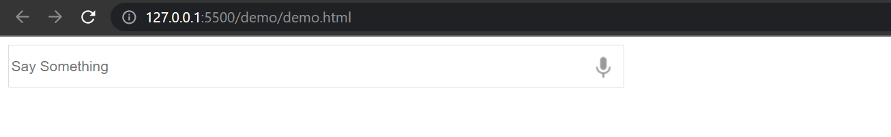

## Сервис Assistant

Основная функция сервиса - распознавание голосовых сообщений и возвращение запрошенного контента и отдельно обобщенной информации также в виде голосового сообщения.
Выделяются несколько этапов:
- преобразование речи в текст
- анализ текста и формирование валидного запроса в сервис movies-api
- формирование текстового сообщения и отдельно запрошенных данных
- преобразование текста в речь и отображение запрошенных данных в браузере

Логика работы: у сервиса будет один эндпойнт, который принимает GET запрос с НЕобязательным параметром query. При первом посещении страницы, GET запрос отправляется без параметров (query=None). Эндпойнт возвращает страницу с формой для получения голосового сообщения.

Пользователь задает вопрос. JS (подзадача 11_voice_processing.md) преобразует голосовое сообщение в текст и высылает обратно на этот же эндпойнт, но в этот раз уже появятся параметры, например "?query=Сколько+фильмов+снял+Спилберг". 
По словам определяется намерение, выбирается подходящая функция-обработчик, которая высылает запрос в movies-api
    ```
    GET /api/v1/films/search?query=captain&page[number]=1&page[size]=50
    ```
Из полученного ответа формируем сообщение "Спилберг снял 5 фильмов"(подзадача 14_demo.md) и добавляем его в темплейт для Jinja(подзадача 12_templates.md). Отдельно в темплейт добавляем список этих фильмов - картинки (подзадача 13_images.md) и описание.
Выводим контент на главную страницу. Должна сохраниться форма с вопросом пользователя. Нужно отобразить новую форму с ответом (он будет зачитан в JS) и информацию по 5ти фильмам.


#### Фреймворк - fastapi
#### Авторизация через сервис auth
#### Нужен только один эндпойнт вида
    ```
    localhost/assistant-api/v1/?query=Сколько+фильмов+снял+Спилберг
    ```
#### В первую очередь реализуем вариант со строгим соответствием вопроса. Считаем, что не могут испольозоваться синонимы, меняться порядок слов, их окончания. Если останется время, нужно будет добавить гибкости вопросам (подзадача 15_intent.md)


Подзадачи:
- 11_voice_processing.md
- 12_templates.md
- 13_images.md
- 14_demo.md
- 15_intent.md

Оценка 13
